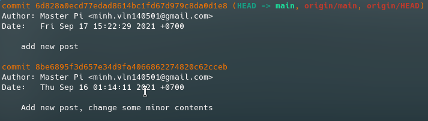

---
# Name of the article
title: "Getting Used to GitHub, Eps. 1"

# Quick description
description: Getting started

# Author of the article
author: Master Pi

# Appears as the tail of the output URL.
slug: "getting-used-to-github-eps-1"

# Date created
date: 2021-09-18T16:36:56+07:00

# Date published. Before that day, the post can not be available
publishDate: 

# Daye expired. After that day, the post can not be available
expiryDate:

# Last modified time of the file
lastmod: 
    - :fileModTime
    - :git
    
# Article's tags
tags: 
    - git
    - github 101
    - commit

# Article's categories: Blog, Project or Guideline
categories:
    - Guideline

# Allow share?
socialShare: true

# Useful to link articles together for "See also" part
series: GitHub 101

# is Math included? Default: false
math: false

# Cover image of the article
image: cover.jpg

---
Hi, this is my first series about how to use git and github effectively. This would include some basic commands, tips and what to do in some specific situations. You also know how to deal with problems occur during the building setup, and a basic knowledge of GitHub Flow, what CI/CD is, ... This is the first post in series "Github 101", and you can find other posts at "See also" section.

This series also contain many real-life situations, and the procedures for each situation. Of course it will never be enough, and it comes from my experience too, so my series could be not enough for you. I reccommend you to leave your comment or help me to complete this guideline for as many people as possible.

# First words
You may don't need to read this part, but I still write for who want to see what is `git` and what it can do. So let's go through some boring theoretical knowledge of it.

`Git` is a tool to managing your code project. That's the simplest meaning of `git`. When you collaborate with your friends in projects, you can't know what others do, and even you also don't know if your code is working or not. So your team will need a ***Version Control System*** to control your code, versions of the project, and you can go back if there are any problems. `Git` helps you get updated with your code, change version of project, see the difference between branchs or commits, merge or create a new branch to work separately,... A lot of work could never be done without `git`, so this means if you want to start you coding life, you must know how to use `git`.

`Github`, `Gitlab`, `BitBucket` are code collaboration and version control tools offering repository management. In this guide, we will focus on `Github`, because it is quite popular (not really true), and quite suitable for starters. But I always reccommend you to try the other options, especially `Gitlab`, and you can decide yourself later.

# Install git
First, let's start by getting `git` on our machine.


* If you are Mac user and have Homebrew installed
```bash
brew install git
```
* If you use Linux, many distros have git installed for you. If not, try installing via package management. For example:
```bash
sudo apt install git
```
* If you use Windows, follow instruction on https://git-scm.com/download/win.

There are also GUI version of git, but I reccommend CLI, for two reasons:
* It looks cooler than GUI
* Almost every git guideline is by commands, so CLI help you understand git better.

# Getting started
Once you got `git` installed, let's dive in.

## Configure
Check git version:
```bash
git --version
```

Configure `git`:
```bash
git config --global user.name "Your name here"
git config --global user.email "Your mail here"
```
These are basic configurations of git to make your life easier, and of course there are more. You can check other configurations with:
```bash
git config -h
```
or check what you edited:
```bash
git config -l
```

## Getting and creating projects
What's git used for? Projects. I hope you guess right. Let's see how we make a project or clone some.

You can make a project, and initialize with git:
```bash
git init
```
It will generate a new folder, named ".git" inside your project. You can take a look to see more, but it's not quite neccessary.

Want to work on a project from Github? Here's how:
```bash
git clone URL_TO_YOUR_PROJECT
```
It will create a folder and download all the content of the project into that folder.

## Commit
So you got you project. Let's make some changes in it. After you complete, you may need to snapshot it to a "***commit***", like a version of the project, or a checkpoint (if you are a gamer), which will track any changes in there. From that, you can easily trace or go back if you code is not working.

In `git`, you may see the term "***stage***". Think it like actors about to perform on stage. They first have to stay in a room behind the stage to prepare, and "***stage***" in `git` is like that too. When you working on changes, you first have to place your file into a place called "***stage***" before taking a snapshot.


To commit changes, run this:
```bash
# Add all changed file to "stage"
git add .

# Create a commit with a message
git commit -m "Your message"
```
You may see the file named *.gitingnore* in your project. This file will contain folders and files you don't want to track (add to stage), so when you run `git add .`, it will add all changed file which are not in the file, to stage. Here is an example of this file:
```bash
# Binaries for programs and plugins
*.exe
*.exe~
*.dll
*.so
*.dylib

# Test binary, built with `go test -c`
*.test

# Output of the go coverage tool, specifically when used with LiteIDE
*.out

# Dependency directories (remove the comment below to include it)
# vendor/
public/
```
So when you run `git add .`, it will ignore files with extension `.exe`, `.exe~`, ..., or `public` folder.

A more tip about how to write a "readable" message: Always show what you have changed, or problem you fix, and it could help you very much when you want to go back. An example:
> *Add README file, fix issue #1, fix rendering error*

not

> *Hey other coders, guess what I changed?*

You can also see history of commits in the current branch by:
```
git log
```
Don't worry, we will discuss about ***branch*** later.


You may see `HEAD`. It is like a pointer. For example, you are currently at commit "Commit 1", so `HEAD` will point to this commit.


You can see details of a commit, by running this:
```
git show COMMIT_ADDRESS
```

While `COMMIT_ADDRESS` is the string of characters right after "commit", or you just use `HEAD` for current commit.

If you want to undo commit, or return to a previous commit, run this command:
```bash
git reset --soft COMMIT_ADDRESS
```
or
```bash
git reset --soft HEAD~n
# n is number of last commits you want to undo
```


# Final words
So above is "**Getting used to Github**", eps. 1. I really want to show more, but a rule in my blog that every post should not exceed 20 minutes read, and I am revising for exam too, I have to spend other usefull commands on next post. You can subscribe to read other articles in the future.

There are some images in the post, some are mine, some are from the Internet, and it's free to use as in the LICENSE below. But I always leave credit here to support authors, and so do you if you want to use content in my article.

- Visualisation of stage: https://rogerdudler.github.io/git-guide/
- HEAD - like a pointer: https://community.atlassian.com/t5/Git-questions/git-checkout-lt-commit-gt-doesn-t-update-commit-history/qaq-p/1100953
- Cover image: https://singleboardbytes.com/649/use-github-raspberry-pi.htm
