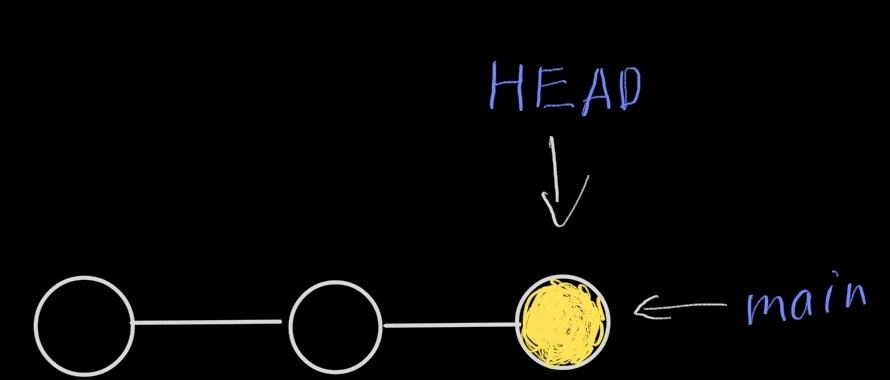
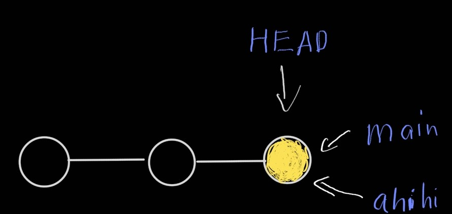
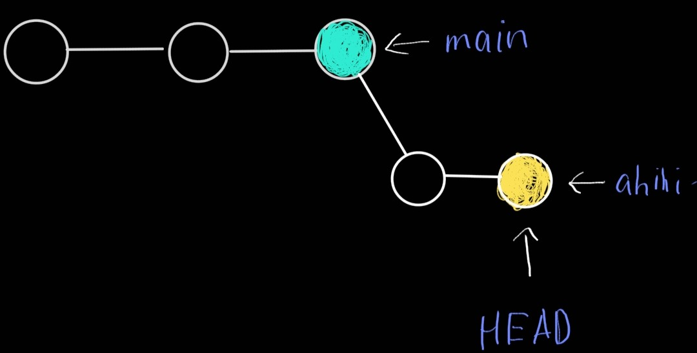
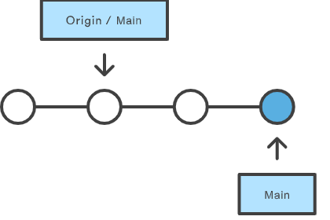
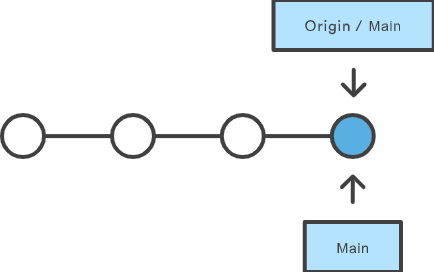
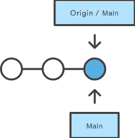
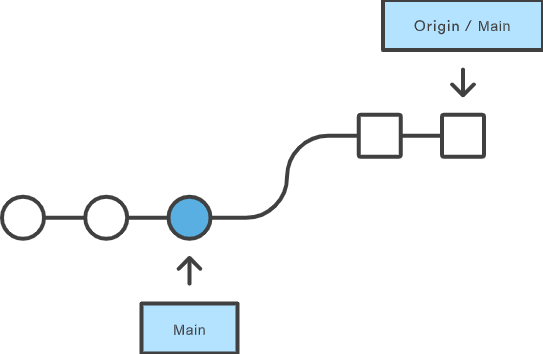
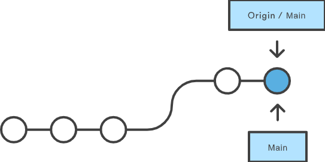

---
# Name of the article
title: "Getting Used to GitHub, Eps. 2"

# Quick description
description: Remote and Branches

# Author of the article
author: Master Pi

# Appears as the tail of the output URL.
slug: "getting-used-to-github-eps-2"

# Date created
date: 2021-09-19T14:11:37+07:00

# Date published. Before that day, the post can not be available
publishDate: 

# Daye expired. After that day, the post can not be available
expiryDate:

# Last modified time of the file
lastmod: 
    - :fileModTime
    - :git
    
# Article's tags
tags: 
    - git
    - github 101
    - branch

# Article's categories: Blog, Project, or Guideline
categories:
    - Guideline

# Allow share?
socialShare: true

# Useful to link articles together for the "See also" part
series: GitHub 101

# is Math included? Default: false
math: false

# Cover image of the article
image: cover.png

# License
license: MIT

---

Hello, in this episode we will discuss branches in git, and how to push, pull or merge. We also talk about the remote repository and local repository, and how to connect them. There are a lot of things to discuss but I will focus on the background, and the remain can be learned by exercising.

# Remote repository
When you clone a repository from the Internet, you may notice that it will copy ***all the content*** of the project, even every versions, branches, ... In other word, you are simply ***link*** the remote project to your local repository. You can check the remote repository with:
```bash
git remote -v
```
The result may be similar to this:
```bash
origin  https://github.com/MasterPi-2124/MasterPi-2124.github.io.git (fetch)
origin  https://github.com/MasterPi-2124/MasterPi-2124.github.io.git (push)
```
`origin` is the shortname of the remote repository that your project was originally cloned from. It is the replacement for the repository's URL, and can be helpful when you push or pull from this remote one. You can change this too, but it's better to leave it unchanged (because people leave that too).

So if you have a local repository and want to connect to a remote repository, simply do this:
```bash
git remote add origin URL_TO_YOUR_PROJECT
```
Be careful before connecting. Run `git commit` if there are unsaved changes.

# Branch
Let's say, you have a project about an application. There are so many versions of it, and you are working on a specific version, `v1.0.6`. The stable version of the application is `v1.0.0`, so you should not fuck up with this because any errors in your code may ruin the project. In this case, you will have to create a new branch, named `v1.0.6` or something, so your change is on this branch, not the stable branch `v1.0.0`. Here is an illustration of **branches** in git:

From the image, you can see that branch is a version of the project, which is isolated from the others and does not affect other versions of the project. You can work in branches, commit changes, push, and merge branches, which will be discussed in this episode.

You can check all branches in your local repository:
```bash
git branch
# Similar to git branch -l
```
Want to see all remote branches too?
```bash
git branch -r
```
You can use `-a` flag to see all local and remote branches.

You can create a new branch too, but not check out to it yet:
```bash
git branch BRANCH_NAME
```
If you want to create a branch and check out:
```bash
git checkout -b BRANCH_NAME
```

Remember that the branches you created above are not shown on the remote repository, they are just at the local and can be checked with `git branch -a`. If you want to create a branch in a remote repository, jump to "[Push](#push)" section.

Want to delete the branch you are working on?
```bash
git branch -d BRANCH_NAME
```
This will *safely* delete the specific branch, it stops if this branch has unmerged changes. You can overwrite this by using `-D` flag, it will delete everything in this branch.

You can jump to different branches too:
```bash
git checkout BRANCH_NAME
```
Make sure `BRANCH_NAME` exists.

Let's go to a specific example. You are here, `main` branch"

Then, create and check out to a local branch named "ahihi":
```bash
git checkout -b ahihi
```

Remember, `HEAD` is now at `ahihi`, not `main` anymore.

`ahihi` is now ahead of `main` with unmerged changes, so you just can't delete `ahihi` safely. You have to use `-D` to completely remove this branch:
```bash
git branch -D ahihi
```

# Push
When you are in a local branch and want to push to the remote repository, you have to commit your change and make sure that ***your local repository is synced with the remote***.
```bash
git push origin BRANCH_NAME
```
This will push to the specific branch in the remote repository. If the branch is not on the remote, this branch will be created. So check carefully before pushing. Here is an illustration of push:

You can also use `git push` to delete a remote branch too:
```bash
git push origin :BRANCH_NAME
```
The colon `:` before branch will tell git push to delete the remote branch. It's suggested to delete both local and remote branches.

# Fetch, Pull and Merge
`git fetch` is a primary command used to download contents from a remote repository. `git fetch` has similar behavior to `git pull`, however, `git fetch` can be considered a safer, nondestructive version. Think `git fetch` like synchronizing the ***remote repository**, which will download all content from the repository without updating the local repository to match that content, while `git pull` creates a merge commit and `HEAD` is updated to point at the new commit.

In conclusion, 
> `git pull` = `git fetch` + `git merge`


In many scenarios, `git pull` may lead to conflict when trying to merge branches, that require you to manually check for differences. More particular situations will be shown in the next episodes.

# Final words
So above is "**Getting used to Github**", eps. 2. This episode contains the most important parts of `git`, so be sure you understand it. If not, leave comments below and try some real-life problems.

There are some images in the post, some are mine, some are from the Internet, and it's free to use as in the LICENSE below. But I always leave credit here to support authors, and so do you if you want to use content in my article.

- Visualisation of push, pull, fetch and merge: https://www.atlassian.com/git/tutorials
- Cover image: https://www.hostinger.vn/huong-dan/huong-dan-su-dung-git-lenh-git-co-ban