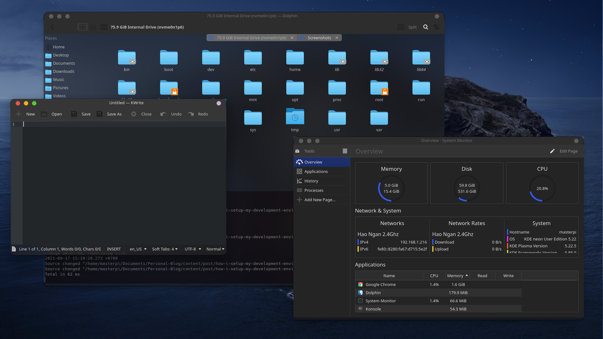
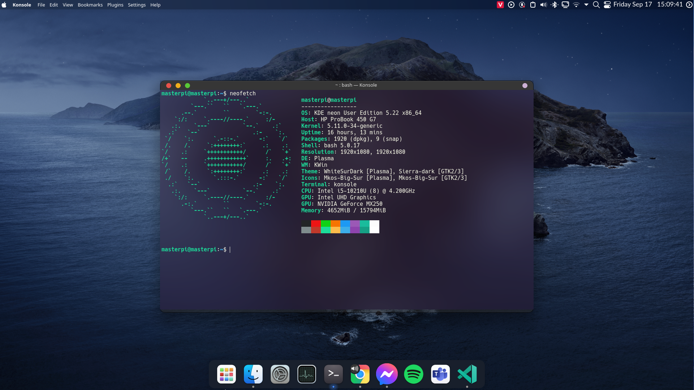

---
# Name of the article
title: "How I Setup My Development Environment"

# Quick description
description: This is some tweaks that I did to make my Linux experiece better

# Author of the article
author: Master Pi

# Appears as the tail of the output URL.
slug: "how-i-setup-my-development-environment"

# Date created
date: 2021-09-16T21:54:03+07:00

# Date published. Before that day, the post can not be available
publishDate: 

# Daye expired. After that day, the post can not be available
expiryDate:

# Last modified time of the file
lastmod: 
    - :fileModTime
    - :git
    
# Article's tags
tags: 
    - linux
    - development

# Article's categories: Blog, Project or Guideline
categories:
    - Guideline
 
# Allow share?
socialShare: true

# Useful to link articles together for "See also" part
series: 

# is Math included? Default: false
math: false

# Cover image of the article
image: cover.png

---

Hi, this is my quick guideline on how to improve linux development experience.

# Operating system
When you search for "Linux OS", Google would give you thousands of "operation systems" like Ubuntu, Arch, Mint, ... So which one is best for you?

First, "Linux" as you say is not "*operating system*". It is the kernel, the ***bridge*** between software and hardware, and reponsible for almost everything in the computer. When you boot your computer, it is the first part of the OS loaded into the RAM for your system to start working.

There are many Linux distributions built upon the kernel and use a separate ***package managing system*** to suit many specific purposes. So before choosing a distro, you should know your reasons of using linux.

- If you are new to linux and just need a boost, start with [Ubuntu](https://ubuntu.com/), [Nitrux](https://nxos.org/) or [Zorin OS](https://zorin.com/os/). They are both friendly to new users, with Windows-like interface, so you shouldn't get confused when migrating.
- If you want to have a perfect environment for developing, [Debian](https://www.debian.org/) is one of your consideration list. There are also many other distros, like [Manjaro](https://manjaro.org/), [openSUSE](https://www.opensuse.org/), [Solus](https://getsol.us/home/), [Fedora](https://getfedora.org/) ... You can install dev-branch of many distros for its specific development too.
- If you want a light weight distro and do not need many unnecessary apps, [Linux Lite](https://www.linuxliteos.com/) or [ZorinOS Lite](https://zorin.com/os/download/15/lite/) is the best choice. 
- If you are advanced user, the only distro I can reccommend is [Arch](https://archlinux.org/).[^1]

[^1]: btw I use Arch.

# Look and feel
***Desktop enviroment*** is also an important part in the OS. I will list some of them here, by my actual experience:
- **KDE Plasma 5**: My most favorite DE, which I am also contributing to.
- **Xfce**: it's really simple and light-weight
- **Cinnamon**: It's good looking at first glance, and easy to tweak too
- **LXDE**: another light-weight DE for old machines
- **GNOME Shell**: The most popular one, and look like MacOS too
- **Deepin**: the best-looking DE by some f*** chinese guys who don't care about privacy

Let's note that you can choose your favorite DE in some distros, but some others don't give you that option.

Here is my KDE Plama DE:
 

# Essential packages
I use so many packages to support my projects, and it depends on your purposes too. But these following are the most importatnt tools that everyone needs.

Remember, you can install them via package managers like `apt`, `pacman`, `pkg`, ... but many of them are not upgrade frequently and it may causes problems with your projects. If you need cutting-edge packages for your project, I suggest installing from source.

1. `git`, and(or) `gh`
2. `docker`
3. `gcc`, `g++`, `make`, `cmake`, `autoconf`, `automake`, `build-essential`, `gdb`
4. Popular languages: NodeJS, python3, ruby, perl, go, java, ...
5. Visual Studio Code, or your favorite text editor.
6. Some system tools: `gparted`, `timeshift`, ...

# What to know?
Using linux means you should know a lot about it, but some errors may appear suddenly and you can't just search Google for help. So basic understanding and skills are required to join the party.

1. **CLI - Commandline Interface**. You have to control everything almost by command in the terminal, so get used to that.
2. **Users and groups**. Permission in Linux is really important, so knowing who you are is the fisrt lesson to survive through system errors.
3. **Compile packages**. There are so many ways to build a package, and this is the most boring part when you have to deal with any errors that can happen anytime. You should be familiar with building from source, installing binary archives, or using package managers. The completion of your experience relies on the number of errors you meet.
4. **Search Google**. This is your life rescuer, so learn how to use it effeciently.
5. **How linux works**. You should have basic knowledge about how a linux system works, the meaning of folders in root directory, how kernel interacts with hardwares and sofwares,... This is useful when you face a system problem (and it's frequent). **Reseting the system** should be the last way of rescuing your system.

# Conclusion
Yes, it's hard, and you may spend your whole life to buid a linux system. But it's funny though.

Some final words, the above is based on my actual experience of 5-year using Linux, so it can contain something hard to understand. And you can personalize your liux distro to suit your need.

Thank you for reading!